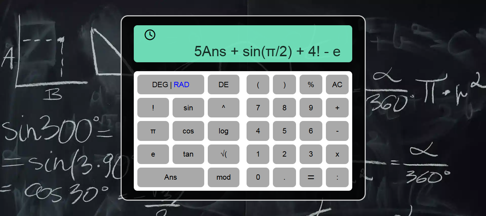
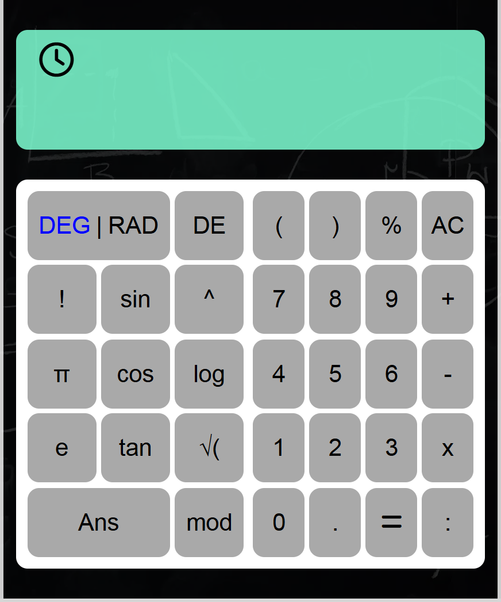

# Scientific Calculator Web App

A web-based scientific calculator built with vanilla JavaScript.
The application features an editable input field with full caret control, keyboard shortcuts, strict input validation,
and a custom expression parsing engine (no use of `eval()`).


---

## Demo
- Live demo: [Calculator](https://passerinevkk.github.io/CALCULATOR/)
- Screenshot:





---

## Features

- Basic operations: `+`, `-`, `*`, `/`, `%`, `^`, `!`, `√`, `mod`
- Scientific functions: `sin`, `cos`, `tan`, `log`
- Constants: `π`, `e`, `Ans`
- Editable input field (cursor can move and edit anywhere)
- Keyboard support:
  - `s` → `sin`
  - `c` → `cos`
  - `t` → `tan`
  - `l` → `log`
  - `Enter` → calculate
  - `Backspace` → delete
- Angle mode support: DEG Mode / RAD Mode
- Input validation:
  - Rejects invalid characters
  - Rejects malformed expressions (e.g. `2abc+2`)
- Input normalization:
  - Before evaluation, expressions are normalized into programming-frendly notation 
    - Example: 
           - `mod` → `%`
           - `:` → `/`
- Calculation history (stored in LocalStorage)

---

## Tech Stack

- HTML5
- CSS3
- Vanilla JavaScript (ES6+)
- No external libraries or frameworks

---

## Expression Evaluation

The calculator does not rely on JavaScript's `eval()` for security and correctness reasons.

Instead, expressions are processed through the following pipeline:
1. Tokenization
2. Infix to Postfix conversion using the Shunting Yard algorithm
3. Postfix expression evaluation

This approach ensures predictable behavior, proper operator precedence, and easier extensibility.

---

## Project Structure

calculator-project/
├── index.html
├── css/
│   └── styleindex.css
├── js/
│   ├── main.js   # UI logic & event handling
│   └── calc.js   # Expression parsing & calculation logic
├── assets/
└── README.md


--- 

## How to Run

1. Clone the repository:
    ```bash
    git clone https://github.com/PasserineVKK/CALCULATOR.git

2. Open the prject folder
    cd calculator-project

3. Open index.html in your browser

--- 

## Usage

- Click anywhere on the calculator to start typing.
- You can edit the expression at any position using the mouse or arrow keys.
- Use keyboard shortcuts for faster input.
- Press Enter to calculate.
- Press AC to clear all input.
- Press Backspace to delete characters.

---

## Limitations

- No support for complex numbers
- Limited error message types

---

## Author

**Passerine**
- GitHub: [Passerine](https://github.com/PasserineVKK)